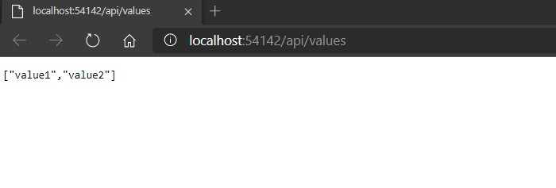

# Module 1: Exploring ASP.NET Core MVC

## Lab: Exploring ASP.NET Core MVC

1. **Nombres y apellidos:** Francisco Javier Moreno Quevedo
2. **Fecha:** 06/12/2020
3. **Resumen del Ejercicio:**  Crear un proyecto Net core Web API comprenderlo y añadir una funcionalidad
4. **Dificultad o problemas presentados y como se resolvieron:** Ninguna


- Ejercicio 2: Exploring a Web API Application

  - Creamos un nuevo proyecto **ASP.NET Core Web API**
  - Añadimos la carpeta Models
  - Añadimos la Clase **CakeStore** con sus propiedades
  - Añadimos la Interface **IData** con el codigo 

    ```cs
         List<CakeStore> CakesList { get; set; }
         List<CakeStore> CakesInitializeData();
         CakeStore GetCakeById(int? id);
    ```

  - Añadimos la clase existente **Data**

  - Añadimos un controlador **CakeStoreAPIController.cs**

    - Añadimos un constructor y dos acciones

  -  En el middleware inyectamos las dependencias de IData

  - Ejecutamos:

    

  - 

    

  - 

    

  - 
